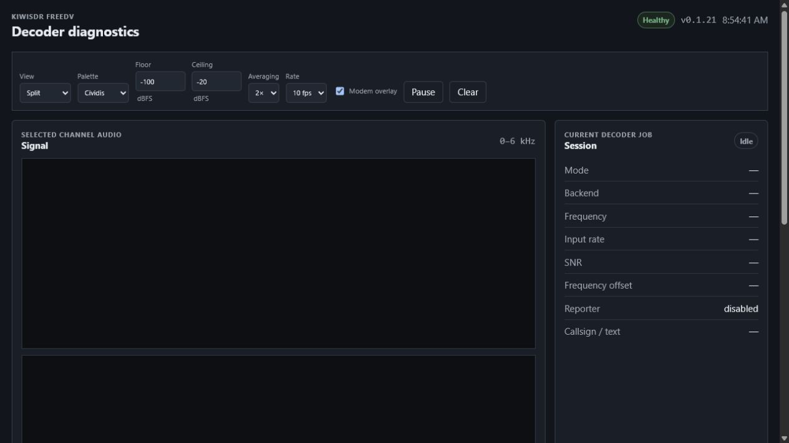

# KiwiSDR FreeDV Extension

Receive-only [FreeDV](https://freedv.org/) decoding for KiwiSDR, with the modem
workload offloaded to a private Debian VM or unprivileged LXC.

The project follows the KiwiSDR TDoA/camper design. In this documentation,
**decoder guest** means the private Debian VM or unprivileged LXC that performs
FreeDV decoding. It connects outbound to the Kiwi, camps on the selected
receiver's sound stream, decodes FreeDV, and returns speech through Kiwi's
standard audio path. Kiwi receiver browsers never contact the decoder guest;
the optional diagnostics page connects to its management-only web port.

> [!IMPORTANT]
> This project is beta software built against KiwiSDR firmware 1.902 and
> upstream commit `c40ecb471dced33689e335689f8ffd35a54f47fa`. Back up the
> Kiwi and create a decoder-guest rollback point before installation.

## Features

- FreeDV extension available in the ordinary KiwiSDR extension menu.
- External Codec2 decoding keeps modem CPU load off the Kiwi's AM335x.
- Decoded speech returns through the normal Kiwi audio stream.
- Analogue noise and static remain silent while FreeDV is running but not
  synchronized; Stop or Close restores normal receiver audio.
- Automatic amateur sideband selection, including USB on 60 metres.
- Reversible DSP handling: opening FreeDV disables the Kiwi noise filter and
  closing it restores the listener's previous selection; the noise blanker is
  left unchanged.
- Mode-specific receiver filters derived from documented FreeDV bandwidths,
  with automatic acquisition-to-sync tightening and Tight, Normal and Wide
  manual overrides.
- Selector for 18 common FreeDV calling frequencies from 160 metres to QO-100.
- Built-in deterministic 700D test using the bundled Kiwi reference recording.
- Optional RX-only [FreeDV Reporter](https://qso.freedv.org/) presence.
- Optional, independently gated RADEV1 decoder.
- Management-LAN-only, read-only decoder diagnostics dashboard with an audio-band
  waterfall, spectrum, ten-minute history and modem statistics.
- Help panel covering the available modes and controls.
- Authenticated Kiwi-to-decoder control, bounded audio queues, health metrics,
  watchdog recovery, atomic Kiwi releases, and rollback tooling.
- Guided Kiwi-side installer with OS detection, zero-listener gates, verified
  backups and coordinated Kiwi/decoder rollback.

## Project status

| Component | Tested version | Status |
| --- | --- | --- |
| Kiwi extension | 0.1.30 | Deployed on KiwiSDR 1.902; browser-accepted and 41-sample soak passed |
| Decoder service | 0.1.21 | Token-free LAN dashboard deployed and browser-tested |
| Legacy transport | Protocol v2 | One receive session; outbound camper connection |
| FreeDV Reporter | RX-only client 0.1.28 | Opt-in; selected RX codec, presence, restart recovery and removal tested |
| RADEV1 | Experimental | Implemented and feature-gated; reference audio decoded |
| AI-64 local decoder | Experimental | ARM64 install/activation/rollback gates implemented; physical validation pending |

The bundled 700D test has passed end to end with returned audio and zero
dropped frames. Live-RF speech acceptance is still pending mode by mode. See
[Mode support](docs/modes.md) and [Deployment status](docs/deployment-status.md)
for the exact evidence and remaining gaps.

## Architecture

```text
Browser                   KiwiSDR                    Decoder guest
   |                         |                             |
   |-- extension control --->|                             |
   |                         |<-- outbound monitor WS -----|
   |                         |--- post-detector audio ---->|
   |                         |<-- decoded PCM / status ----|
   |<--- standard audio -----|                             |-- Codec2
   |                         |                             |-- RADEV1 (optional)
   |                         |                             `-- Reporter (optional)
```

The Kiwi remains the only receiver endpoint. The decoder service does not
require public port forwarding. Its decoder control and health surfaces remain
private; the read-only diagnostics dashboard is available only to the
configured management LAN and relies on that firewall boundary.

External decoding is intentional: the Kiwi's single-core processor already
handles RF processing, receiver channels, waterfalls, audio and networking.
See [Why run an external decoder guest?](docs/external-decoder-vm.md) for the
resource, isolation and VM-versus-LXC trade-offs.

An optional [BeagleBone AI-64 local-decoder path](docs/ai64-local-decoder.md)
runs the same resource-bounded service over loopback on John's supported AI-64
Kiwi platform. Its installer, offline benchmark, activation and rollback gates
are implemented, but remain explicitly unverified on physical AI-64 hardware.

## Supported modes

| Mode | Typical use | Current integration status |
| --- | --- | --- |
| 1600 | Early FreeDV HF waveform | Codec2 backend and Kiwi SSB path implemented |
| 700C | Fast synchronization on stronger HF signals | Codec2 backend and Kiwi SSB path implemented |
| 700D | Weak-signal HF | End-to-end bundled reference test passed |
| 700E | Faster fading with lower latency than 700D | Codec2 backend and Kiwi SSB path implemented |
| 800XA | 4FSK through SSB | Codec2 backend and Kiwi SSB path implemented |
| 2400A | Wide VHF/UHF SDR channel | Selectable; 48 kHz modem path still required |
| 2400B | Audio through an analogue FM radio | Selectable; 48 kHz and FM receive paths still required |
| RADEV1 | Neural HF speech | Experimental, disabled by default |

“Implemented” means the selector, authenticated protocol and decoder backend
recognize the mode. It does not imply live-RF validation. The detailed mode
guide covers bandwidths, filters, approximate SNR thresholds, modem behavior
and selection advice: [docs/modes.md](docs/modes.md).

## Requirements

- KiwiSDR 2 running firmware 1.902 for the current reference build.
- A supported Kiwi backup microSD card for full physical recovery.
- Debian 11 or Debian 12 on the Kiwi host; the installer detects and validates
  it before changing the live receiver.
- Private Debian 11 or Debian 12 VM/unprivileged LXC reachable from the Kiwi
  LAN, unless using the experimental AI-64 local path.
- Recommended decoder allocation: 2 vCPU, 2 GB RAM and 16 GB disk.
- Root or equivalent administrative access to the Kiwi and decoder guest.
- A unique 256-bit shared secret stored only in root-readable environment
  files.
- A KiwiSDR source checkout at the pinned upstream commit.

The reference deployment uses Proxmox, but the decoder is an ordinary Debian
service and is not tied to a specific hypervisor or guest ID.

## Installation

> [!CAUTION]
> Installation builds and replaces the executable used by a live KiwiSDR.
> Atomic rollback cannot recover damaged eMMC, a bootloader failure or
> hardware. Use a verified supported backup microSD for full physical
> recovery, and review scripts before running them as root.

The recommended path is the guided installer run from a reviewed local clone
on the Kiwi:

```bash
git clone https://github.com/smegoff/kiwisdr-freedv-extension.git /root/kiwi-freedv
cd /root/kiwi-freedv
sudo ./tools/install-freedv.py --dry-run
sudo ./tools/install-freedv.py
```

It prompts for local AI-64 or external VM/LXC mode, private addresses,
fresh-install or configuration-only decoder preparation, recovery readiness
and optional RADEV1. Reporter and RADEV1 remain disabled by default. The
installer detects Debian 11/12 on each relevant host and uses a pinned Codec2
source fallback when Debian 11's package lacks required APIs.

The external VM/LXC must already exist, have a stable private address and have
a verified SSH host key plus a snapshot or independent backup. The installer
does not create or modify Proxmox resources.

Installation still has two independently reversible parts:

1. Provision the Debian decoder guest and install the C++ decoder service.
2. Apply the pinned overlay to KiwiSDR source, build the production
   `kiwid.bin`, and activate it as a versioned release.

Start with the [guided one-shot installer](docs/one-shot-installer.md). The
[complete manual procedure](docs/installation.md) remains available for
advanced or site-specific deployments. Both cover:

- Kiwi configuration and physical backup;
- VM/LXC creation and firewall policy;
- decoder dependencies, build and systemd installation;
- shared-secret generation and configuration;
- overlay application and production Kiwi build;
- browser acceptance, health checks and stability soak; and
- automatic and manual rollback.

## Using the extension

1. Open a KiwiSDR receiver and choose **FreeDV** from the extension menu.
2. Select the transmitted FreeDV mode.
3. Tune manually or choose a common calling frequency.
4. Press **Start**.
5. Watch the state, backend, synchronization, SNR, frequency offset,
   callsign/text, dropped-frame and Reporter fields.
6. Press **Stop** or close the panel to restore the previous receiver mode,
   passband, noise-filter selection and normal audio.

The default **Auto (lock on sync)** receiver filter begins with acquisition
headroom and tightens once the modem first synchronizes. That narrower passband
remains locked for the transmission. Retuning, changing mode or restarting the
session resets acquisition. Use **Tight**, **Normal** or **Wide** when local
conditions need a fixed manual passband.

The **Test** button runs a bundled 700D recording through the same Kiwi camper,
decoder and returned-audio path used for live reception. A passing test proves
the transport and Codec2 pipeline are working; it does not test the antenna,
RF signal level or every FreeDV mode.

## Decoder diagnostics

Decoder service 0.1.21 installs a lightweight read-only dashboard at
`http://freedv-decoder.local:8076/`. It visualizes the selected receiver's
post-detector audio, not the Kiwi wideband RF waterfall. No application login
is required: every host allowed through the management firewall can view it.
The waterfall offers Cividis, Viridis, greyscale and the OpenWebRX Turbo,
Classic/teejeez and HA7ILM colour schemes.
See [Decoder diagnostics dashboard](docs/dashboard.md) for installation,
network security, display options, API framing and troubleshooting.



## FreeDV Reporter

Reporter is disabled by default and operates strictly as the Kiwi owner's
RX-only station identity. It never publishes a public listener's browser name,
IP address or identity.

To enable it, configure a valid station callsign and Maidenhead locator in
Kiwi Admin, enable Reporter, and start a normal FreeDV session. The panel shows
`enabled (idle)` while no session is active, `enabled (test excluded)` during
the local reference Test, and `connecting` then `online` during a normal Start.
The decoder
guest's Reporter sidecar connects outbound to `qso.freedv.org`; no inbound
firewall rule is required. Full setup and troubleshooting are in
[Optional FreeDV Reporter](docs/installation.md#8-optional-freedv-reporter).
While a normal session is running, the public station row reports the selected
codec in **RX Mode**. It never sends a TX event, so **TX Mode** correctly remains
`N/A` for this receive-only integration.

## RADEV1

RADEV1 uses the pinned portable RADE C implementation and FARGAN speech
synthesizer. It is disabled by default and requires both gates:

1. `FREEDV_ENABLE_RADE=1` on the decoder guest; and
2. **Enable RADEV1** in Kiwi Admin.

Enable it only after the RADEV1 reference and load tests pass on the target
decoder guest. RADEV1 live-RF speech validation remains pending.

## Testing

Run the repository regression tests from the project root:

```bash
python -m unittest discover -s tests -v
```

Decoder builds also provide CTest-based backend, framing, resampling and
reference-audio tests. Deployment is accepted only after a real-browser test
and independent Kiwi/decoder stability soaks. The reference deployment passed
41 checks per host at 15-second intervals with no critical errors.

## Safety and rollback

- Kiwi candidates are versioned and activated atomically.
- Deployment health gates verify the service, `/status` and receiver HTML.
- The stock `baseline-1.902` release and the immediately previous candidate are
  retained.
- Decoder snapshots are short-term rollback points, not backups. Superseded
  release snapshots are pruned after acceptance and soak testing.
- Shared secrets and configuration archives are excluded from Git.
- Physical eMMC recovery still requires a supported Kiwi backup microSD card.

Read [docs/rollback.md](docs/rollback.md) before deploying a candidate.

## Release publication gate

A deployment is not complete until its matching source, tests and public
documentation are committed and pushed to GitHub. The tracked branch must be
synchronized with its upstream branch, and the open pull request must record
the deployed versions, validation evidence and rollback point. Secrets,
private configuration archives and operational logs remain in ignored storage
and are never published.

## Documentation

- [Installation](docs/installation.md)
- [Guided one-shot installer](docs/one-shot-installer.md)
- [FreeDV mode support](docs/modes.md)
- [External decoder VM/LXC](docs/external-decoder-vm.md)
- [BeagleBone AI-64 local decoder](docs/ai64-local-decoder.md)
- [Camper/control protocol](docs/protocol.md)
- [Backup and rollback](docs/rollback.md)
- [Feasibility and headroom](docs/feasibility.md)
- [Reference deployment status](docs/deployment-status.md)

## Repository layout

| Path | Purpose |
| --- | --- |
| `decoder/` | C++17 Kiwi camper client, resampler and Codec2/RADE backends |
| `dashboard/` | Dependency-free HTML, CSS and JavaScript diagnostics UI |
| `reporter/` | Isolated RX-only FreeDV Reporter sidecar |
| `kiwi-overlay/` | Kiwi server/client overlay and reproducible patches |
| `deploy/` | Decoder environment examples, firewall and systemd definitions |
| `tools/` | Backup, build, deployment, test, soak and rollback helpers |
| `docs/` | Architecture, installation, operation and validation records |

## Security

Do not commit Kiwi, Proxmox or decoder credentials. Use process environment
variables and root-readable configuration files as documented. The shared
secret authenticates decoder control polls and must be unique for each
installation.

If you find a security issue, avoid publishing credentials, private station
configuration or exploitable details in a public issue. Contact the repository
owner privately first.

## Contributing

Issues and pull requests are welcome. Please include the Kiwi firmware version,
decoder release, FreeDV mode, relevant health output and reproducible test
steps. Remove callsigns, addresses, secrets and other private station data from
logs before posting them.

## Acknowledgements

This project builds on:

- [KiwiSDR](https://github.com/jks-prv/KiwiSDR) by John Seamons;
- [FreeDV](https://freedv.org/) and
  [Codec2](https://github.com/drowe67/codec2) by David Rowe and contributors;
- [FreeDV Reporter](https://qso.freedv.org/); and
- the portable RADE work in
  [peterbmarks/radae_nopy](https://github.com/peterbmarks/radae_nopy).

FreeDV, Codec2, KiwiSDR and the upstream projects remain independent projects;
this repository provides an integration framework for receive-only use.
