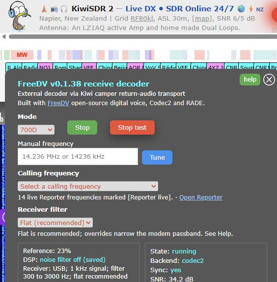
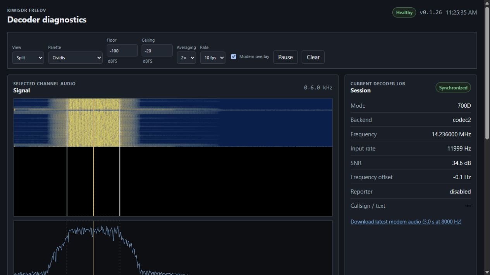

# KiwiSDR FreeDV project update — late July to 14 August 2026

I have made a fair number of changes to the KiwiSDR FreeDV extension since the
end of July. The current reference deployment is Kiwi extension **v0.1.38** on
KiwiSDR firmware 1.902, with decoder service **v0.1.26** running on a private
Debian guest under Proxmox.

The Kiwi itself is the normal AM335x model. All Codec2 and RADEV1 modem work is
offloaded to the external guest using the Kiwi camper/return-audio design; this
is not an AI-64 build.

## Main updates

1. **Returned audio and decoder reliability**
   - Fixed broken/stuttering decoded speech caused by complete modem frames
     being returned to the Kiwi in bursts.
   - Decoded PCM is now paced to the normal Kiwi sound-packet cadence, with a
     bounded 500 ms queue and stale audio discarded rather than accumulated.
   - Fixed the camper authentication/bootstrap sequence and added automatic
     recovery when the decoder socket remains connected but authenticated Kiwi
     control replies stop.
   - Health data now includes control-response age and control-stall counters,
     so a stale connection is distinguishable from a healthy idle one.

2. **Deterministic 700D and RADEV1 reference tests**
   - The Test button now follows the selected family: **Test 700D** for the
     Codec2 modes and **Test RADE** for RADEV1.
   - Both references pass through the real Kiwi sound channel, external
     decoder and standard Kiwi returned-audio path. They are not browser-only
     audio samples.
   - Reference tests are excluded from FreeDV Reporter.

3. **RADEV1 support**
   - RADEV1 uses the portable C implementation from `freedv/rade_c`, not the
     original Python decoder.
   - It remains feature-gated and experimental, and runs only on the external
     decoder guest in this installation.
   - RADEV1 is the default selection when the administrator has enabled it;
     otherwise the extension falls back to 700D.
   - The deterministic RADE reference has synchronized and decoded at about
     0.02 real-time factor on the reference guest.

4. **Public KiwiSDR reverse-proxy operation**
   - FreeDV has been tested as an ordinary listener through John's
     `proxy.kiwisdr.com` service.
   - Both Test 700D and Test RADE synchronized and returned audio through the
     public receiver connection.
   - The public browser still talks only to the Kiwi. The private decoder,
     shared secret, health service and diagnostics port are not exposed by the
     proxy.

5. **FreeDV Reporter improvements**
   - The integration remains RX-only and uses the Kiwi owner's configured
     station identity, never a listener's identity or address.
   - A normal receive session publishes the selected codec in Reporter's
     **RX Mode** field. No TX event is sent.
   - The calling-frequency selector now also receives currently advertised
     Reporter frequencies through the authenticated private relay. They are
     marked **[Reporter live]** and disappear when stale.

6. **Tuning and receiver setup**
   - Added a FreeDV-owned manual frequency field accepting MHz, kHz or Hz.
   - Added the common FreeDV calling-frequency list from 160 metres through
     QO-100.
   - LSB/USB selection follows normal amateur convention automatically,
     including USB on 60 metres.
   - The recommended receiver path is now a flat 300–3000 Hz SSB passband.
     Mode-shaped +350, +200 and +50 Hz overrides remain available for local
     interference tests.
   - Opening FreeDV temporarily disables the Kiwi noise filter, denoiser and
     automatic notch processing; the listener's previous settings are restored
     when the extension closes. The noise blanker is left unchanged.

7. **Interface and Help**
   - Reworked the panel spacing and made the manual-frequency control compact
     enough to keep status and links inside the modal.
   - Added fuller Help for every mode, receiver filtering, calling frequencies,
     tests, RADEV1, Reporter and troubleshooting.
   - Added FreeDV/Codec2/RADE acknowledgement and direct links to FreeDV and the
     public project repository.

8. **Local decoder diagnostics**
   - Added a lightweight, dependency-free diagnostics dashboard on the private
     management LAN.
   - It shows the selected channel's post-detector audio waterfall and spectrum,
     SNR/frequency-offset history, session state, queue and modem counters.
   - It includes Cividis, Viridis, greyscale and OpenWebRX-style palettes, plus
     a bounded download of the latest modem audio for fault comparison.
   - A **Decoder diagnostics (LAN)** link appears in the extension only when the
     Kiwi page was opened from a private/local hostname. Public proxy listeners
     do not see it.

9. **Deployment and rollback protection**
   - Rebased and redeployed against KiwiSDR 1.902 after the official update
     replaced the custom binary.
   - Fixed the production web build so an empty optimized Kiwi browser bundle
     cannot pass the candidate, activation or rollback gates.
   - Kiwi builds use versioned atomic releases, streamed configuration backups,
     automatic health rollback and a retained known-good custom release.
   - Decoder upgrades retain their own guest snapshot and previous binary/assets.

## Current test status

- The clean 700D and RADEV1 references pass end to end with synchronization,
  continuous returned PCM and zero dropped frames.
- The same reference path has passed through the public KiwiSDR reverse proxy.
- The current legacy backend supports FreeDV 1600, 700C, 700D, 700E, 2400A,
  2400B and 800XA. Live-RF acceptance is still being recorded mode by mode.
- 2400A/2400B require the appropriate VHF/FM 48 kHz receive path and remain
  integration-only on the present 12 kHz HF receiver configuration.
- RADEV1 live-RF speech validation is still experimental even though its
  deterministic reference test is working.

## Screenshots

FreeDV v0.1.38 running the built-in 700D reference through the external Codec2
backend:

Decoder v0.1.26 showing the synchronized 700D audio-band waterfall, spectrum
and current decoder job:

Project repository and installation details:
[smegoff/kiwisdr-freedv-extension](https://github.com/smegoff/kiwisdr-freedv-extension)

